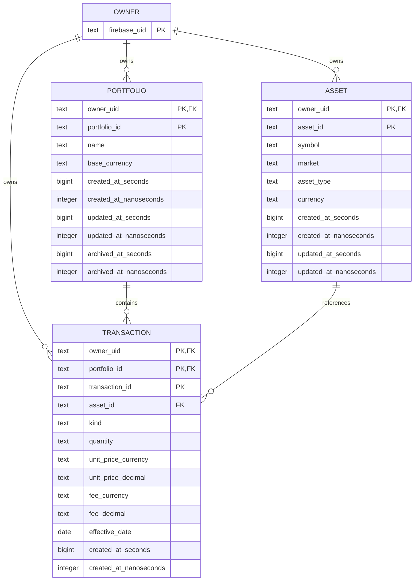

# 011 — Modelo relacional lógico

- **Ticker:** `011`
- **Escopo:** modelo lógico para a migração da persistência patrimonial atual.
- **Estado:** baseline proposta para validação na 015/016; não é DDL nem migration.

## Decisões de modelagem

1. `owner` representa a identidade externa verificada pelo Firebase. O Firebase
   UID é uma chave opaca, imutável e única; não há perfil ou credencial Supabase
   implícito neste modelo.
2. Portfolio, Asset e Transaction preservam seus document IDs como `text`. As
   chaves primárias são compostas por `owner_uid` e o ID local. Assim, qualquer
   FK só é válida dentro do mesmo owner.
3. Asset continua compartilhável entre Portfolios do owner. A relação com
   Portfolio permanece indireta, por Transaction.
4. `assetIdentities` não vira tabela: a identidade canônica é uma unique
   constraint em Asset. `identityKey` do export é somente evidência de validação
   e não uma segunda fonte de verdade.
5. `assetUsages` não vira tabela: a existência de Transaction é a referência
   autoritativa e `ON DELETE RESTRICT` impede apagar um Asset referenciado. A
   ausência histórica de usage deve ser auditada antes da promoção.
6. Position, MarketPosition, Allocation e dashboards continuam derivados do
   ledger. Nenhum deles é persistido neste modelo.

## ERD lógico



As relações compostas são deliberadas: `TRANSACTION(owner_uid, portfolio_id)`
referencia `PORTFOLIO(owner_uid, portfolio_id)` e
`TRANSACTION(owner_uid, asset_id)` referencia `ASSET(owner_uid, asset_id)`.
Não existe FK somente por `portfolio_id` ou `asset_id`, pois isso permitiria
cross-owner reference.

## Tabelas, tipos e constraints

Os tipos abaixo são tipos lógicos PostgreSQL. O mapeamento EF Core/Npgsql deve
ser validado em 016 contra PostgreSQL real; não se deve gerar DDL a partir desta
tabela sem revisar os checks.

| Tabela/coluna | Tipo lógico | Null | Constraint/semântica |
| --- | --- | --- | --- |
| `owner.firebase_uid` | `text` | não | PK; valor vem somente de `sub` verificado, nunca do body/query. |
| `portfolio.owner_uid`, `portfolio.portfolio_id` | `text` | não | PK composta; FK para Owner; ID opaco preservado. |
| `portfolio.name` | `text` | não | Após trim, 1–100 caracteres; não aceitar string somente whitespace. |
| `portfolio.base_currency` | `text` | não | Exatamente `BRL` na V1; sem FX nesta fase. |
| `portfolio.created_at_*`, `updated_at_*` | `bigint` + `integer` | não | Par indivisível de segundos e nanossegundos. |
| `portfolio.archived_at_*` | `bigint` + `integer` | sim | Ambos nulos ou ambos preenchidos; archive não remove filhos. |
| `asset.owner_uid`, `asset.asset_id` | `text` | não | PK composta; FK para Owner; ID opaco preservado. |
| `asset.symbol`, `asset.market` | `text` | não | Forma normalizada em uppercase e gramática do domínio. |
| `asset.asset_type` | `text` | não | Um de `stock`, `etf`, `fii`, `fund`, `bond`, `crypto`, `other`. |
| `asset.currency` | `text` | não | Código de moeda válido conforme Value Object. |
| `asset.created_at_*`, `updated_at_*` | `bigint` + `integer` | não | Mesma representação lossless temporal. |
| `transaction.owner_uid`, `portfolio_id`, `transaction_id` | `text` | não | PK composta; FKs owner-scoped para Owner e Portfolio. |
| `transaction.asset_id` | `text` | não | FK owner-scoped para Asset; `ON DELETE RESTRICT`. |
| `transaction.kind` | `text` | não | Somente `buy` ou `sell`; tipos futuros não são aceitos por abertura. |
| `transaction.quantity` | `text` | não | Decimal canônico, positivo, sem expoente. |
| `transaction.unit_price_currency` | `text` | não | Código de moeda do Value Object `UnitPrice`; preservar junto com o decimal. |
| `transaction.unit_price_decimal` | `text` | não | Decimal canônico, positivo, sem expoente. |
| `transaction.fee_currency` | `text` | sim | Código de moeda do Value Object `Fee`; nulo somente quando fee é nula. |
| `transaction.fee_decimal` | `text` | sim | Decimal canônico não negativo; zero canônico vira `NULL`, como no domínio. |
| `transaction.effective_date` | `date` | não | Data civil `YYYY-MM-DD`, sem conversão de timezone. |
| `transaction.created_at_seconds` | `bigint` | não | Parte de ordenação, preservada sem conversão para `Date`. |
| `transaction.created_at_nanoseconds` | `integer` | não | `0..999999999`; parte de ordenação. |

Para todos os pares temporais, `nanoseconds` deve estar entre `0` e
`999999999`; campos nullable devem ser preenchidos ou nulos em conjunto. A
ordenação do ledger é:

```text
effective_date ASC,
created_at_seconds ASC,
created_at_nanoseconds ASC,
transaction_id ASC
```

Ela é a mesma ordenação de `compareTransactions`; a ordem física ou de inserção
do PostgreSQL não é contrato.

## Decisão de precisão decimal

O contrato atual aceita até 30 dígitos inteiros e 18 fracionários. Isso não cabe
com segurança no `System.Decimal` (nem em `double`/`number`). A baseline escolhe
armazenar a forma canônica como `text`, mantendo no Domain/Application o valor
como string validada e aritmética por `BigInteger`/racionais. HTTP também usa
string; nunca JSON number.

O formato persistido é equivalente a:

```text
0 | [1-9][0-9]*
com uma parte fracionária opcional de 1..18 dígitos, sem zero final
```

Além da gramática, a validação conta no máximo 30 dígitos inteiros e 18
fracionários. Quantity e unit price devem ser maiores que zero; fee deve ser
nula ou não negativa. Um `CHECK` PostgreSQL pode validar a gramática e comparar
com `numeric` somente depois dela, mas `numeric` não é a representação
autoritativa nem deve ser mapeado automaticamente para `System.Decimal`.

### Experimento obrigatório na 015/016

Com PostgreSQL real e Npgsql, gravar e ler os limites sintéticos abaixo e
comparar a string byte a byte e o resultado do reducer:

| Caso | Resultado esperado |
| --- | --- |
| 30 dígitos inteiros + 18 fracionários | aceita sem arredondar ou expoente |
| 30 dígitos inteiros + 19 fracionários | rejeita |
| 31 dígitos inteiros | rejeita |
| `0`, `0.1`, fee nula | `0` só permitido onde o domínio permite; fee zero normaliza para nulo |
| `1.0`, expoente, zero à esquerda | rejeita forma não canônica |
| soma/subtração de limites | mesmo racional e mesma materialização do golden master TS |

Sem esse experimento, não se deve trocar a coluna por `numeric(48,18)` ou
assumir que um conversor EF para `decimal` é lossless.

## Decisão de precisão temporal

`effective_date` é `date`. Para timestamps, a baseline escolhe dois campos
inteiros (`seconds`, `nanoseconds`) em vez de `timestamptz` isolado. Isso
preserva exatamente o contrato do Firestore para Transaction e torna a ordenação
explícita. `timestamptz` pode ser uma projeção de leitura futura, mas não é a
fonte canônica.

O extrator deve ler os componentes do Timestamp bruto, nunca um `Date` já
materializado. Portfolio e Asset têm hoje uma perda potencial nos parsers que
convertem para `Date`; a execução de migração deve ler o export bruto e registrar
`nanoseconds = 0` somente quando a origem comprovadamente não tiver essa
precisão. Se a origem não permitir distinguir os valores, o registro deve ser
marcado como perda/invalidado para decisão, não promovido silenciosamente.

O experimento temporal usa dois Transactions com o mesmo microssegundo e nanos
diferentes, além de IDs em ordem inversa. O resultado esperado é preservar nanos
e ordenar por nanos e depois ID. A mesma prova deve cobrir segundos negativos se
forem aceitos pelo tipo de Timestamp da origem.

## Matriz Firestore → PostgreSQL

| Origem | Destino | Transformação e validação |
| --- | --- | --- |
| `users/{uid}` namespace | `owner.firebase_uid` | Copiar UID opaco para chave; relatório usa pseudônimo e nunca imprime UID. Criar uma vez por owner. |
| `portfolios/{portfolioId}` path | `portfolio.owner_uid`, `portfolio_id` | Extrair owner do path; preservar ID como texto; confirmar que não existe owner divergente no conteúdo. |
| `name` | `portfolio.name` | Aplicar a mesma validação/trim do domínio; inválido vai para quarentena. |
| `baseCurrency` | `portfolio.base_currency` | Exigir `BRL`; não converter moeda nem criar FX implícito. |
| `createdAt`, `updatedAt` | pares `*_at_seconds/nanoseconds` | Ler Timestamp bruto e preservar componentes; falta/forma inválida é quarentena. |
| `archivedAt` ausente ou `null` | `archived_at_* = NULL` | Ambos são estados ativos válidos; registrar `LEGACY_DEFAULT_APPLIED` somente quando o campo estiver ausente. Valor não nulo exige par temporal válido. |
| `assets/{assetId}` path | `asset.owner_uid`, `asset_id` | Preservar owner e ID; conferir que o documento pertence ao namespace extraído. |
| `symbol`, `market`, `assetType`, `currency` | mesmas colunas em Asset | Normalizar somente conforme contrato conhecido; colisão ou alteração semântica é quarentena. |
| `identityKey` | unique constraint de Asset | Recalcular da tupla canônica e comparar. Não carregar coluna/registry de domínio. |
| Asset timestamps | pares temporais de Asset | Timestamp bruto, sem usar o `Date` do parser Web/Admin como fonte. |
| `transactions/{transactionId}` path | `transaction.owner_uid`, `portfolio_id`, `transaction_id` | Preservar os três componentes; validar portfolio existente e owner-scoped. |
| `kind` | `transaction.kind` | Aceitar somente `buy`/`sell`. Outros valores são inválidos, não “corrigidos”. |
| `assetId` | `transaction.asset_id` | Resolver FK owner-scoped; órfão ou cross-owner vai para quarentena. |
| `quantity` | `transaction.quantity` | Exigir forma canônica/limites; não arredondar nem converter para número binário. |
| `unitPrice.currency`, `unitPrice.decimal` | `transaction.unit_price_currency`, `unit_price_decimal` | Preservar o par do Value Object; validar moeda e decimal sem perder a moeda. |
| `fee.currency`, `fee.decimal` | `transaction.fee_currency`, `fee_decimal` | Preservar o par quando fee não for nula; fee ausente ou explicitamente nula gera ambos nulos. |
| `effectiveDate` | `effective_date` | Preservar data civil; rejeitar timezone, horário ou calendário não suportado. |
| `createdAt` | `created_at_seconds/nanoseconds` | Preservar componentes; participa da ordenação total. |
| `assetIdentities/{identityKey}.assetId` | unique constraint de Asset | Validar contra Asset; duplicata/órfão gera diagnóstico. Não é tabela alvo. |
| `assetUsages/{assetId}.assetId` | nenhum | Comparar com Transactions; referência alvo é FK `RESTRICT`. Ausência não autoriza delete. |
| `assetUsages/{assetId}.createdAt` | nenhum | Não é fato patrimonial nem timestamp de domínio; registrar somente presença/anomalia no relatório de reconciliação. |

Documentos desconhecidos, campos extras ou campos obrigatórios ilegíveis não
entram na carga principal. A regra de compatibilidade de `archivedAt` e `fee` é
restrita aos defaults acima; não é uma autorização para preencher fatos faltantes.

## FKs, lifecycle e append-only

- Delete de Portfolio é bloqueado quando houver Transactions; archive é uma
  alteração explícita de estado e não cascade.
- Delete de Asset é bloqueado por qualquer Transaction, inclusive histórica.
  A auditoria compara o ledger, não apenas `assetUsages`.
- Portfolio arquivada permanece legível, mas não recebe Transaction nova.
- A Application abre uma transação, bloqueia a linha da Portfolio com `FOR
  UPDATE`, verifica owner/arquivo e só então insere a Transaction. Archive e
  restore usam o mesmo lock; assim uma criação concorrente e um archive são
  serializados. Um trigger/check de defesa pode rejeitar insert para Portfolio
  arquivada, mas não substitui o lock e a autorização do caso de uso.
- Transaction não tem UPDATE/DELETE para o papel de runtime. A correção do
  ledger ocorre por novo fato compensatório, conforme o domínio.
- A API exige `transaction_id` ou uma idempotency key que produza o mesmo ID.
  Repetição com o mesmo ID e payload canônico é no-op; payload divergente é
  conflito. Um retry sem identidade estável não é considerado idempotente.
- O reducer confiável continua obrigatório antes do write; constraints de
  referência não substituem a validação agregada de `SELL`.

## Índices derivados das queries atuais

| Necessidade observada | Índice/constraint inicial | Motivo; não é índice especulativo |
| --- | --- | --- |
| Buscar/listar Portfolio por owner e lifecycle | PK `(owner_uid, portfolio_id)` e índice `(owner_uid, archived_at_seconds, portfolio_id)` | Substitui scan por owner e filtro de arquivamento; o nanos do archive não é critério de busca. |
| Listar Assets de um owner por ID | PK `(owner_uid, asset_id)` | A listagem atual ordena por ID; a PK já atende. |
| Resolver identidade canônica de Asset | unique `(owner_uid, symbol, market, asset_type, currency)` | Substitui `assetIdentities` e suporta criação/edição atômica. |
| Listar ledger de uma Portfolio | `(owner_uid, portfolio_id, effective_date, created_at_seconds, created_at_nanoseconds, transaction_id)` | Suporta a ordem total sem scan/ordenação em memória. |
| Verificar referências de um Asset | `(owner_uid, asset_id, portfolio_id, transaction_id)` | Necessário para lifecycle/delete, auditoria e leitura por Asset; não é posição persistida. |

Não há índice para Position, Quote, Allocation, `updated_at` ou futuras features.
Volumetria, planos `EXPLAIN` e paginação da UX podem alterar essa lista em 016,
mas qualquer adição deve apontar para uma query real.

## EF Core, Npgsql, schema e ambientes

- O `DbContext` pertence à Infrastructure; Domain não referencia EF Core,
  Npgsql ou PostgreSQL. O mapeamento deve manter IDs/decimais/timestamps como
  descritos acima.
- Migrations são artefatos revisados e executados por migration job separado do
  startup da API. Em produção, o processo é forward-only com backup/restore ou
  forward fix; `Down` não é rollback de dados patrimoniais.
- O schema patrimonial é privado. Supabase é PostgreSQL gerenciado, não Auth,
  Data API ou credencial para o browser. A anon key e credenciais de conexão
  nunca são distribuídas ao frontend.
- Um papel dono de schema/migrations não é usado pelo runtime. O runtime recebe
  somente as permissões necessárias e não pode mutar/deletar Transaction.
- Pooling transacional é aceitável para requests sem estado de sessão. Migrations,
  locks e qualquer operação que exija estado de sessão usam conexão dedicada ou
  sessão compatível com o pooler, validada em PostgreSQL real.
- Local e test usam PostgreSQL real e migrations idênticas às de staging/prod.
  Seeds são somente sintéticos, determinísticos e descartáveis; produção não
  recebe seed automático.

## Decisões ainda abertas para 015/016

- confirmar o mapeamento EF/Npgsql de `text` canônico e os checks sem estreitar
  o valor para `System.Decimal`;
- confirmar o export bruto que preserva Timestamp e a política para origem já
  materializada como `Date`;
- medir volumetria e validar cada índice com `EXPLAIN (ANALYZE, BUFFERS)` em
  dados sintéticos representativos;
- decidir, em ADR posterior, se RLS será defesa adicional. Ela não substitui
  CurrentOwner, FKs, permissões nem testes com pooling real.

Nenhuma dessas pendências autoriza criar uma tabela de registry, persistir
Position, expor o schema ao browser ou iniciar carga de dados reais.
